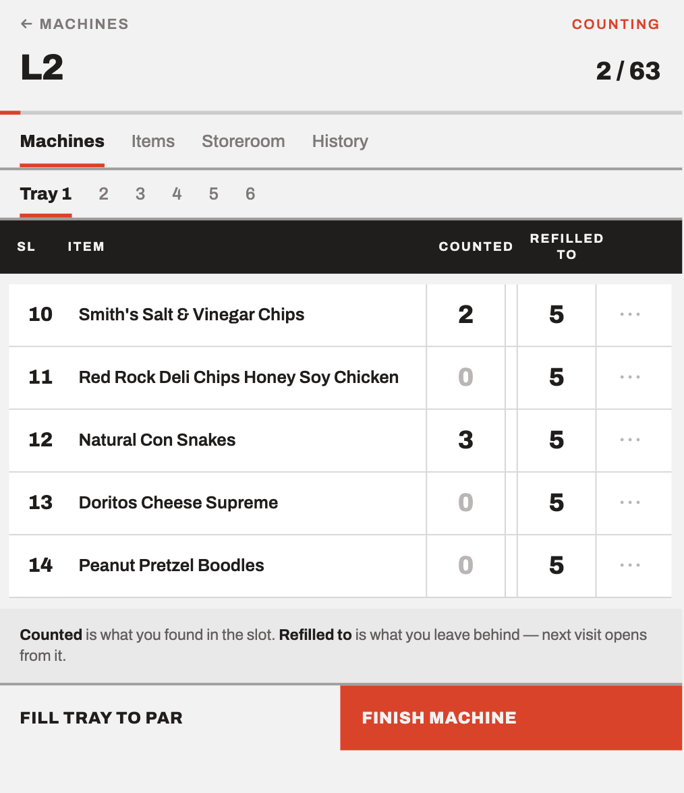
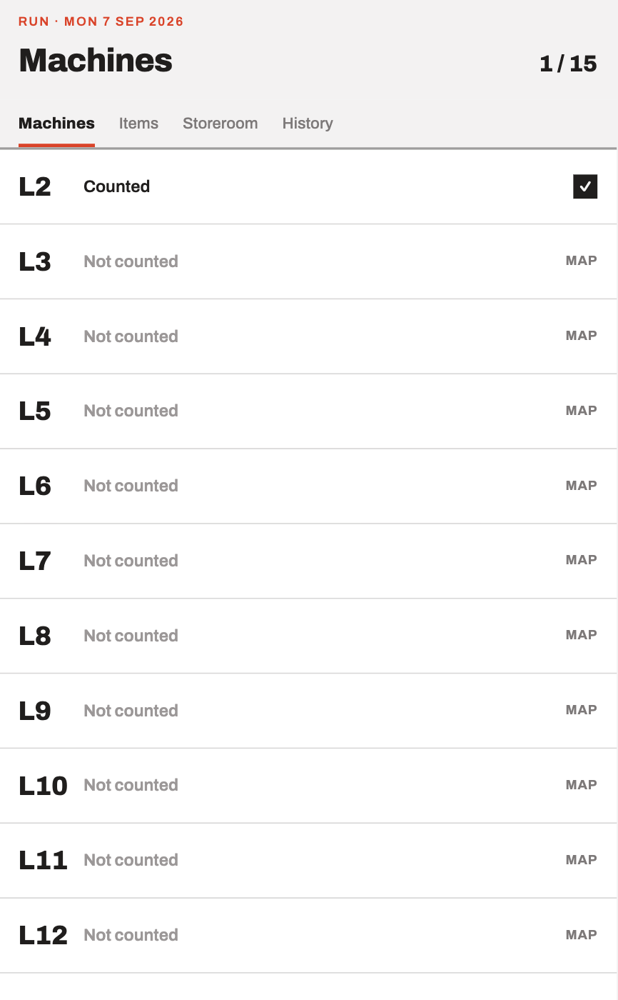
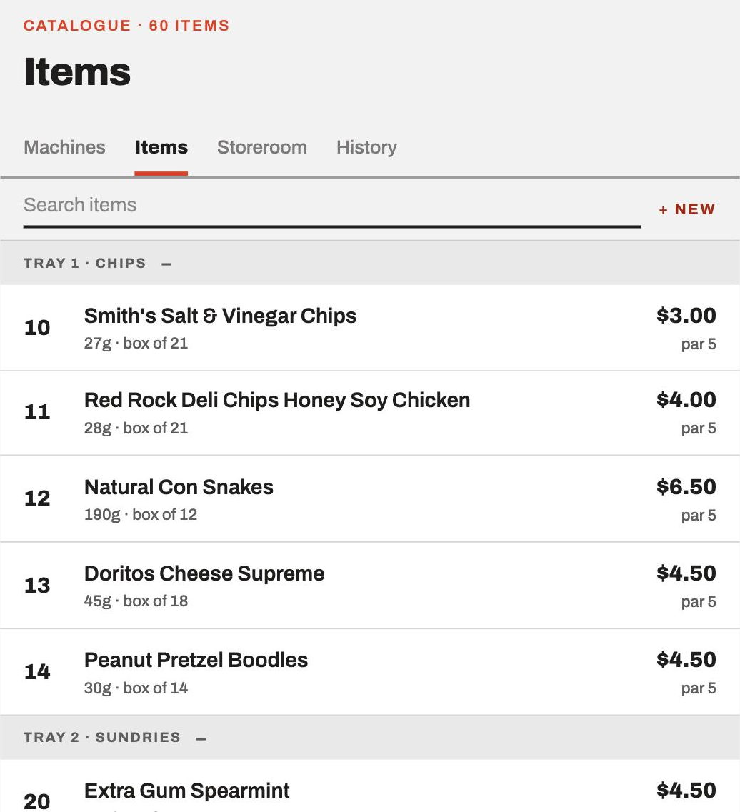
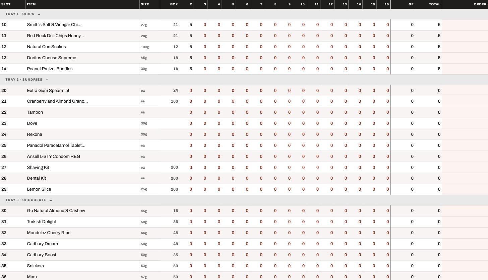

# Vending Stock Manager

An offline-first PWA for restocking vending machines, built to replace the paper stock sheets used to service 15 machines in a hotel.

**Live demo: [vending-stock-manager.pages.dev](https://vending-stock-manager.pages.dev)**

## What it does and why

Servicing a floor of vending machines means counting what is left in every slot, working out what to bring up from the storeroom, and knowing what to reorder from the supplier. That was being done on paper twice a week, with the arithmetic redone by hand each run.

This app records the count at the machine on a phone, derives demand from the history, and turns it into a trolley load, a storeroom balance, and a supplier order. There is no backend: the data lives in IndexedDB on the operator's own phone, and the app keeps working with no network.

Built for one operator, in use on real runs, and shaped by their feedback between shifts.

## Features

- **Counting at the machine.** Per-slot before and after counts on a phone-width screen, grouped by tray, with a "fill tray to par" shortcut.
- **Per-machine maps.** Fifteen machines each with their own slot map, because floors drift from the master map as products change over or go out of stock.
- **Sales without a till.** Vending machines report nothing, so sales are worked out by comparing the count at one visit against the count at the next, adjusted for any stock moved by hand in between. When a period cannot be trusted (no earlier visit to compare against, a visit left unfinished) it is flagged as such, so a figure that is genuinely unknown never gets reported as zero sales.
- **Demand forecast.** Estimates how empty each slot will be by the time the run reaches it, from that slot's own sales rate and the days since the machine was last counted. Machines skipped on a previous run are forecast on the real gap, so the emptiest machines don't get under-loaded.
- **Trolley allocation.** When there is not enough on the trolley to fill everything, it ranks the slots: ones that actually ran dry last period come first, then the fastest sellers. A cut line on screen marks where the stock runs out, so it is clear before setting off which slots will go short.
- **Storeroom ledger.** A running balance per item, with a manual count that resets the estimate to truth.
- **Reorder suggestion.** Projects a week of demand plus three days of slack, subtracts what is already in the storeroom, and rounds the shortfall up to whole supplier cartons.
- **Stock matrix.** Every item against every machine, plus storeroom, total, and the order suggestion. A cell stays blank where there is no demand rate yet, which is how the table says "no data" instead of guessing.
- **Backup and restore.** Full JSON export and import, stamped with the schema version that wrote it.
- **Installable and offline.** Service worker, app icons, and no network dependency at run time.

## Tech stack

| | |
|---|---|
| UI | React 19, TypeScript, Tailwind CSS 4 |
| Build | Vite 6, vite-plugin-pwa (Workbox) |
| Storage | Dexie 4 over IndexedDB, schema at version 4 with three upgrades |
| Tests | Vitest, Testing Library, fake-indexeddb |
| Hosting | Cloudflare Pages |

## Architecture

**`src/domain/`** holds the business logic as pure functions: forecasting, allocation, sales reconciliation, ordering, tray and slot resolution. It imports no React, no Dexie, and nothing from the data layer. That boundary is enforced mechanically: `src/domain/purity.test.ts` reads every domain source file and fails the build if one of them imports I/O.

**`src/data/`** wraps Dexie behind typed repositories, and owns the schema, its migrations, and the starter catalogue.

**`src/ui/`** is one folder per screen, each with its own tests, plus a shared `components/` folder. The screens with non-trivial loading and editing state (run, report, storeroom, trolley) keep it in a hook of their own.

## Getting started

Requires Node 20 or newer. No backend, no API keys, no environment variables.

```bash
git clone https://github.com/hanhsienlei/vending-stock-manager.git
cd vending-stock-manager
npm install
npm run dev
```

To see it with data, open **Items** and tap **Load starter catalogue**. That loads a 60 item catalogue across 15 machines. The button only appears while the catalogue is empty, which is the guard against overwriting real data.

## Testing

```bash
npm test           # single run
npm run test:watch
```

820 tests across 53 files, covering domain arithmetic, repositories exercised against a real IndexedDB fake, and screen-level user flows.

## Deployment

```bash
npm run build      # tsc --noEmit && vite build
npm run deploy     # build, then deploy to Cloudflare Pages via wrangler
```

HTTPS is a hard requirement. ID generation uses `crypto.randomUUID()`, which only exists in a secure context, and a PWA will not install over plain HTTP.

## Screenshots

| Counting a machine | Run progress |
|---|---|
|  |  |

Counting is two columns: what you found in the slot, and what you left behind. The second opens the next visit, which is what makes sales derivable without a till.



The stock matrix puts every item against every machine, with the order suggestion in the last column. It is the one screen built for landscape.



## Project docs

`docs/` is the working record kept during development, not generated documentation:

- [`decisions.md`](docs/decisions.md), choices made and the reasoning behind them
- [`known-gaps.md`](docs/known-gaps.md), features deliberately not built and defects deliberately not fixed, each with its reasoning
- [`handover.md`](docs/handover.md), per-release notes covering what changed, what did not, and how to roll back
- [`user-context/user-story.md`](docs/user-context/user-story.md), the original problem statement in the operator's own words

## License

MIT. See [LICENSE](LICENSE).
